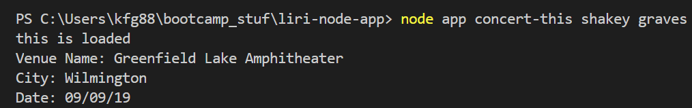
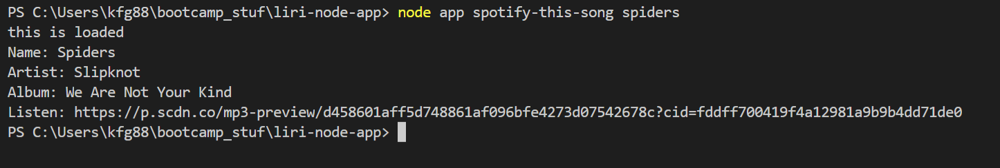
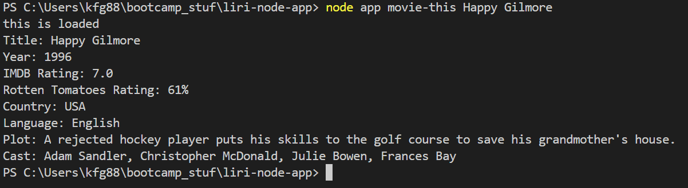
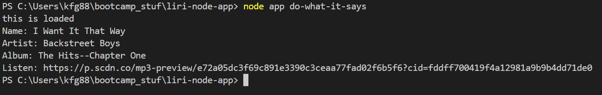

# liri-node-app

Liri, or a Language Interpretation and Recognition Interface, is a small app used to search through multiple databases and provide the user
with information about their favorite touring artist, song, or movie.

----------------------------------------------------------

## Running the App

Using git bash/terminal run

 #### `npm install`
 
 to pull the external packages from the `package.json` which include 
 
  * [Node-Spotify-API](https://www.npmjs.com/package/node-spotify-api)

  * [Axios](https://www.npmjs.com/package/axios)
    
  * [Moment](https://www.npmjs.com/package/moment)
  
  * [DotEnv](https://www.npmjs.com/package/dotenv)

After the external packages are downloaded the use the following commands in git bash/terminal to search.

#### `node app concert-this <artist or band name>`

#### `node app spotify-this-song <song title>`

#### `node app movie-this <movie title>`

#### `node app do-what-it-says`

